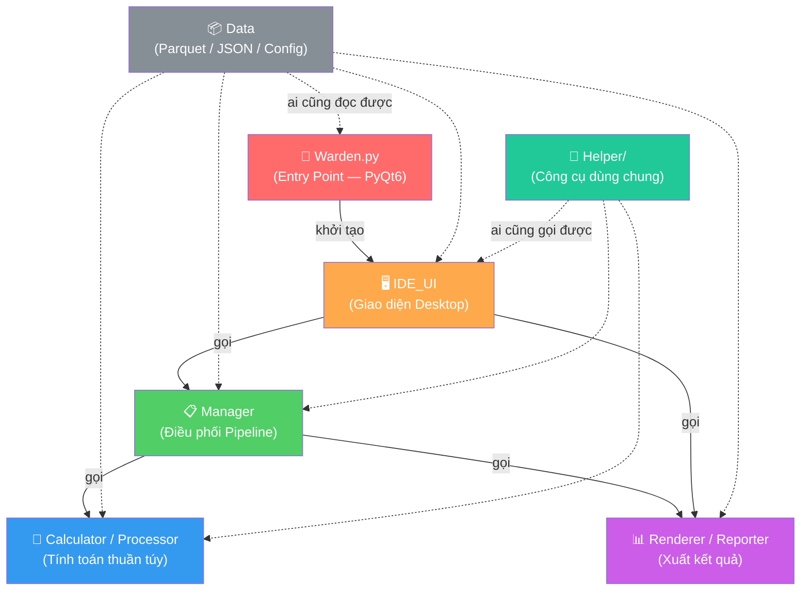
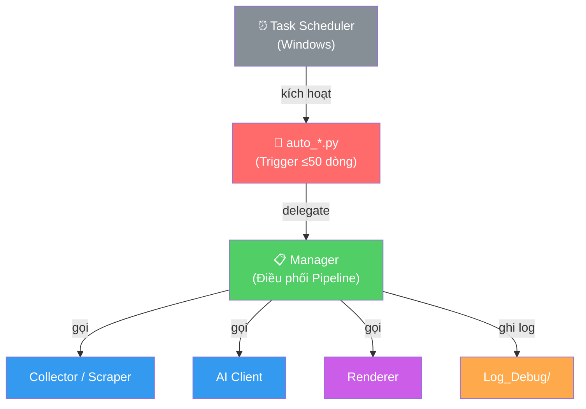

# Chương 0 — EF-S-00: Dependency Direction (Luật hướng gọi)

> **Nền tảng lý thuyết:**
> - **Nguyên tắc:** Dependency Rule (Quy tắc phụ thuộc)
> - **Nguồn gốc:** *Clean Architecture* — Robert C. Martin (Uncle Bob), 2017
> - **Giải thích:** Trong một hệ thống phần mềm, các module cấp cao (điều phối) được phép gọi module cấp thấp (tính toán), nhưng **TUYỆT ĐỐI KHÔNG** được gọi ngược lại. Nếu vi phạm, hệ thống sẽ phát sinh vòng phụ thuộc (Circular Dependency), khiến việc sửa 1 chỗ sẽ ảnh hưởng dây chuyền ra hàng chục chỗ khác.

## 0.1. Sơ đồ hướng gọi 1 chiều (Kiến trúc hệ thống)



## 0.2. Sơ đồ hướng gọi cho Trigger tự động



## 0.3. Giải thích từng mũi tên

| Từ                | Đến                       | Ý nghĩa                                                                   | Ví dụ thực tế                                      |
| ----------------- | ------------------------- | -------------------------------------------------------------------------- | -------------------------------------------------- |
| **Warden**        | IDE_UI                    | Entry point chỉ khởi tạo QApplication + MainWindow. Không chứa logic.     | `Warden.py` → `MainWindow()`                       |
| **IDE_UI**        | Manager                   | UI nhận event từ user, gọi Manager để xử lý.                              | `center_workspace.on_click()` → `NewsManager.run()` |
| **IDE_UI**        | Renderer                  | UI có thể gọi Renderer để hiển thị kết quả.                               | `IDE_UI` gọi `news_renderer.render_html()`         |
| **Manager**       | Calculator / Processor    | Manager cần tính toán → gọi module tính toán.                              | `NewsManager` gọi `ai_client.analyze()`            |
| **Manager**       | Renderer                  | Manager cần xuất kết quả → gọi Renderer.                                   | `NewsManager` gọi `news_renderer.save_html()`     |
| **auto_*.py**     | Manager                   | Script tự động chỉ trigger, delegate MỌI logic sang Manager.              | `auto_news.py` → `NewsManager.run_full_pipeline()` |
| **Data**          | *(Bị đọc bởi mọi nơi)*   | Data chỉ chứa file dữ liệu thuần. Module nào cũng ĐƯỢC ĐỌC, nhưng Data không gọi ai. | `Phase_1_Data/` được đọc bởi Phase 2 lẫn Phase 3 |
| **Helper**        | Mọi nơi (trừ Warden)     | Công cụ dùng chung, bất kỳ module nào cũng gọi được.                       | `config.py` được import bởi mọi module             |

## 0.4. Danh sách CẤM gọi ngược

| Module               | KHÔNG ĐƯỢC GỌI                             | Lý do                                                                                                                 |
| -------------------- | ------------------------------------------ | --------------------------------------------------------------------------------------------------------------------- |
| **Calculator**       | ❌ Manager, IDE_UI, Warden, Renderer        | Calculator là "não bộ" thuần tính toán. Nếu nó gọi ngược Manager thì logic bị dính chặt vào pipeline, không thể tái sử dụng. |
| **Renderer**         | ❌ Manager, IDE_UI, Warden, Collector       | Renderer chỉ nhận dữ liệu đầu vào và xuất kết quả. Nếu nó gọi ngược Manager thì ranh giới trách nhiệm bị xoá nhoà.  |
| **Manager**          | ❌ Warden, IDE_UI                           | Manager nhận lệnh từ IDE_UI hoặc Auto/, không bao giờ gọi ngược lên.                                                  |
| **Helper/config.py** | ❌ Bất kỳ module nghiệp vụ nào             | Helper là "thư viện công cộng". Nếu nó gọi vào module cụ thể, nó mất tính độc lập.                                    |

```python
# ✅ ĐÚNG — Manager gọi Calculator (từ trên xuống)
class NewsManager:
    def run_full_pipeline(self):
        raw_data = news_scraper.fetch_feeds(urls)
        analysis = ai_client.analyze(raw_data)
        news_renderer.save_html(analysis)

# ❌ SAI — Calculator gọi ngược Manager (từ dưới lên)
class AiClient:
    def analyze(self, data):
        NewsManager.save_result(data)  # VI PHẠM!
```

## 0.5. Cross-Phase Dependency Map

Các phase không tách biệt — output của phase trước là input của phase sau:

```
Phase 1 ──.parquet──→ Phase 2 ──DataFrame──→ Phase 3 ──.pkl model──→ Phase 4
                                                  ↑
                                           Phase 5 (feed sentiment data)
```

Quy tắc:
- ✅ Phase sau ĐƯỢC ĐỌC output của phase trước
- ❌ Phase trước KHÔNG ĐƯỢC biết phase sau tồn tại (không import ngược)
- ❌ Hai phase KHÔNG ĐƯỢC gọi chéo nhau (Phase 2 không gọi Phase 4)
- ✅ Phase 5 là NGOẠI LỆ — được feed data vào Phase 3 vì chạy xuyên suốt

## 0.6. Quy tắc đặc biệt cho module Data

Folder `Phase_1_Data/`, `Phase_5_Data/`, file `config.py` là ngoại lệ: **bất kỳ module nào cũng được phép đọc**. Lý do: chúng chỉ chứa dữ liệu thuần túy hoặc constants, không có logic xử lý, nên việc đọc không tạo ra vòng phụ thuộc.

```python
# ✅ Calculator đọc Data — Hoàn toàn hợp lệ
from Helper.config import DATA_DIR, VNSTOCK_DIR

df = pd.read_parquet(os.path.join(VNSTOCK_DIR, f"{symbol}_historical.parquet"))
```
