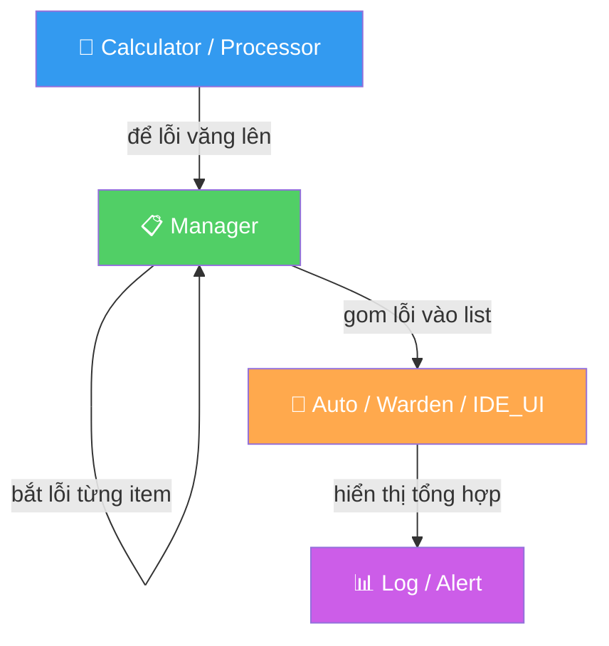

# Chương 2 — EF-S-02: Error Handling Strategy (Chiến lược xử lý lỗi)

> **Nền tảng lý thuyết:**
> - **Nguyên tắc:** Error Handling Best Practices
> - **Nguồn gốc:** *Clean Code*, Chương 7 ("Error Handling") — Robert C. Martin
> - **Giải thích:** Lỗi phải được xử lý có hệ thống theo từng tầng. Tầng tính toán (Calculator) để lỗi văng lên tự nhiên. Tầng điều phối (Manager) bắt lỗi từng item để không chết cả batch. Tầng giao diện (Warden/Auto) bắt lỗi toàn cục và báo cáo. **TUYỆT ĐỐI CẤM** nuốt lỗi im lặng dưới mọi hình thức.

## 1. Xử lý lỗi theo tầng



| Tầng                     | Cách xử lý                                                                        | Lý do                                                                                         |
| ------------------------ | ---------------------------------------------------------------------------------- | --------------------------------------------------------------------------------------------- |
| **Calculator / Processor** | ❌ KHÔNG bắt lỗi (`try/except`). Để lỗi tự văng lên tầng trên.                    | Tầng này chỉ tính toán thuần túy. Nếu dữ liệu sai, nó PHẢI báo lỗi ngay thay vì trả kết quả sai. |
| **Manager**              | ✅ Bắt lỗi **TỪNG item** trong vòng lặp. Gom vào `list` error details.             | Nếu 1 item lỗi mà dừng cả batch 1800 mã → lãng phí. Bắt từng cái để xử lý tiếp.              |
| **Auto / Warden**        | ✅ Bắt lỗi **TOÀN CỤC** (`KeyboardInterrupt`, `Exception`).                       | Đây là tầng cuối cùng. Nếu lỗi lọt tới đây mà không bắt → crash không dấu vết.                |

## 2. Hành vi TUYỆT ĐỐI CẤM

```python
# ❌ CẤM (1) — Nuốt lỗi im lặng
try:
    do_something()
except Exception:
    pass                         # Lỗi biến mất, debug bất khả thi

# ❌ CẤM (2) — Skip không dấu vết
try:
    do_something()
except Exception:
    continue                     # Không log, không ai biết lỗi gì

# ❌ CẤM (3) — Print rồi quên (chạy ngầm thì mất)
try:
    do_something()
except Exception as e:
    print(e)                     # Auto/ chạy ngầm → print đi đâu?

# ❌ CẤM (4) — Bare except (bắt cả SystemExit, KeyboardInterrupt)
try:
    do_something()
except:                          # KHÔNG BAO GIỜ dùng bare except
    pass

# ✅ BẮT BUỘC — Mọi except PHẢI ghi log đầy đủ rồi mới quyết định
try:
    do_something()
except Exception as e:
    logging.error(f"[{module_name}] {e}", exc_info=True)
    # Rồi mới quyết định: continue (Resilient) HOẶC raise (Strict)
```

**Nguyên tắc tuyệt đối:** Dù strategy là gì, **MỌI exception đều phải được ghi lại** (log) trước khi quyết định xử lý tiếp. Không có ngoại lệ.

## 3. Error Strategy theo từng Phase

| Phase | Chiến lược | Ý nghĩa | Khi nào dùng |
|---|---|---|---|
| **Phase 1** | Retry + Resume | Lỗi API → retry → bỏ qua mã đó → cào tiếp | Cào data 1800 mã, gián đoạn là bình thường |
| **Phase 2** | Strict — Crash ngay | Sai 1 con số → dừng ngay, không tha | Tính toán indicator — sai = hỏng model |
| **Phase 3** | Graceful + Checkpoint | Lưu tiến trình → crash vẫn resume được | Training hàng giờ, crash = mất hết |
| **Phase 4** | Zero Tolerance | Sai giao dịch → dừng ngay | Mô phỏng — sai 1 trade = sai equity curve |
| **Phase 5** | Resilient | 1 nguồn chết → bỏ qua, cào nguồn khác | Cào tin từ 4+ nguồn, 1 nguồn die = bình thường |

## 4. Mẫu code chuẩn

```python
# ✅ ĐÚNG — Manager bắt lỗi từng item, ghi nhận chi tiết
error_details = []
for symbol in all_symbols:
    try:
        data = data_collector.fetch(symbol, start_date)
        data.to_parquet(output_path)
    except Exception as e:
        error_details.append(f"❌ {symbol}: {e}")
        logging.error(f"[data_collector] {symbol}: {e}", exc_info=True)

logging.info(f"Hoàn thành: {len(all_symbols) - len(error_details)}/{len(all_symbols)} OK")

# ✅ ĐÚNG — Auto/ bắt lỗi toàn cục
def main():
    try:
        NewsManager.run_full_pipeline()
    except KeyboardInterrupt:
        logging.info("Cancelled by user")
    except Exception as e:
        logging.critical(f"[auto_news] FATAL: {e}", exc_info=True)

if __name__ == "__main__":
    main()
```
