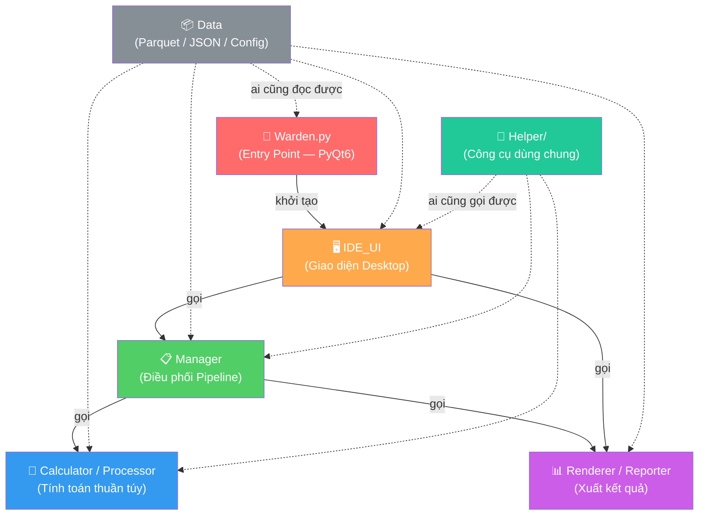
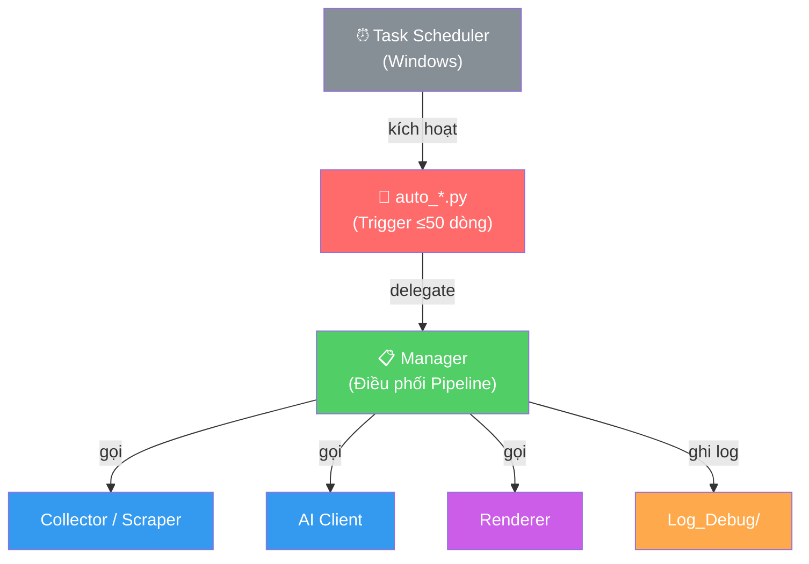
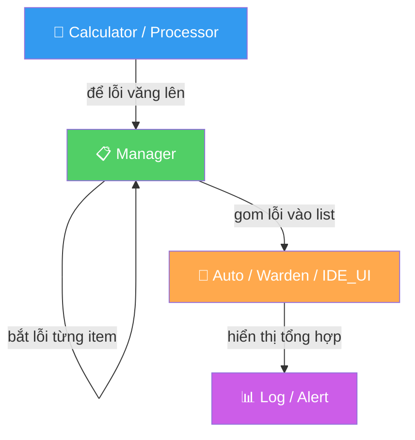

# E_CYBER-FINANCIAL DESIGN STANDARD (EF-S)

> Tiêu chuẩn thiết kế phần mềm cho dự án E_CYBER-FINANCIAL.
> Mọi AI Agent và Developer khi tham gia dự án **BẮT BUỘC** phải đọc hiểu và tuân thủ toàn bộ nội dung trong tài liệu này.

---

## 📑 Mục lục

| Chương | Mã      | Tên                         | Phạm vi                               |
|--------|---------|-----------------------------|-----------------------------------------|
| 0      | EF-S-00 | Dependency Direction        | Sơ đồ hướng gọi, luật gọi 1 chiều      |
| 1      | EF-S-01 | Data Structure (SRP)        | Tách file, đặt tên, cấu trúc thư mục   |
| 2      | EF-S-02 | Error Handling Strategy     | Xử lý lỗi theo tầng, zero tolerance    |
| 3      | EF-S-03 | Data Pipeline Management    | Ghi file, checkpoint, immutability      |
| 4      | EF-S-04 | Logging & Debug             | Quy chuẩn ghi log                      |
| 5      | EF-S-05 | Shared Code Promotion       | Quy trình thăng cấp code               |
| 6      | EF-S-06 | Library Catalog             | Kho thư viện + security audit           |
| 7      | EF-S-07 | UI Architecture — Backend   | Khung sườn PyQt6 (tạm)                  |
| 8      | EF-S-08 | UI Architecture — Frontend  | Khung sườn C# frontend (tách FE/BE)     |
| 9      | —       | Phase 1 — Data Prep         | Collector, Cleaner, Validator           |
| 10     | —       | Phase 2 — Algorithms        | Technical Indicators                    |
| 11     | —       | Phase 3 — ML Training       | Arena Runner, 4-tier architecture       |
| 12     | —       | Phase 4 — Backtesting       | Simulator, Trade Engine                 |
| 13     | —       | Phase 5 — News Integration  | Scraper, Sentiment, Anchor              |

---
---

# Chương 0 — EF-S-00: Dependency Direction (Luật hướng gọi)

> **Nền tảng lý thuyết:**
> - **Nguyên tắc:** Dependency Rule (Quy tắc phụ thuộc)
> - **Nguồn gốc:** *Clean Architecture* — Robert C. Martin (Uncle Bob), 2017
> - **Giải thích:** Trong một hệ thống phần mềm, các module cấp cao (điều phối) được phép gọi module cấp thấp (tính toán), nhưng **TUYỆT ĐỐI KHÔNG** được gọi ngược lại. Nếu vi phạm, hệ thống sẽ phát sinh vòng phụ thuộc (Circular Dependency), khiến việc sửa 1 chỗ sẽ ảnh hưởng dây chuyền ra hàng chục chỗ khác.

## 0.1. Sơ đồ hướng gọi 1 chiều (Kiến trúc hệ thống)



## 0.2. Sơ đồ hướng gọi cho Trigger tự động



## 0.3. Giải thích từng mũi tên

| Từ                | Đến                       | Ý nghĩa                                                                   | Ví dụ thực tế                                      |
| ----------------- | ------------------------- | -------------------------------------------------------------------------- | -------------------------------------------------- |
| **Warden**        | IDE_UI                    | Entry point chỉ khởi tạo QApplication + MainWindow. Không chứa logic.     | `Warden.py` → `MainWindow()`                       |
| **IDE_UI**        | Manager                   | UI nhận event từ user, gọi Manager để xử lý.                              | `center_workspace.on_click()` → `NewsManager.run()` |
| **IDE_UI**        | Renderer                  | UI có thể gọi Renderer để hiển thị kết quả.                               | `IDE_UI` gọi `news_renderer.render_html()`         |
| **Manager**       | Calculator / Processor    | Manager cần tính toán → gọi module tính toán.                              | `NewsManager` gọi `ai_client.analyze()`            |
| **Manager**       | Renderer                  | Manager cần xuất kết quả → gọi Renderer.                                   | `NewsManager` gọi `news_renderer.save_html()`     |
| **auto_*.py**     | Manager                   | Script tự động chỉ trigger, delegate MỌI logic sang Manager.              | `auto_news.py` → `NewsManager.run_full_pipeline()` |
| **Data**          | *(Bị đọc bởi mọi nơi)*   | Data chỉ chứa file dữ liệu thuần. Module nào cũng ĐƯỢC ĐỌC, nhưng Data không gọi ai. | `Data_Main/` được đọc bởi Phase 2 lẫn Phase 3 |
| **Helper**        | Mọi nơi (trừ Warden)     | Công cụ dùng chung, bất kỳ module nào cũng gọi được.                       | `config.py` được import bởi mọi module             |

## 0.4. Danh sách CẤM gọi ngược

| Module               | KHÔNG ĐƯỢC GỌI                             | Lý do                                                                                                                 |
| -------------------- | ------------------------------------------ | --------------------------------------------------------------------------------------------------------------------- |
| **Calculator**       | ❌ Manager, IDE_UI, Warden, Renderer        | Calculator là "não bộ" thuần tính toán. Nếu nó gọi ngược Manager thì logic bị dính chặt vào pipeline, không thể tái sử dụng. |
| **Renderer**         | ❌ Manager, IDE_UI, Warden, Collector       | Renderer chỉ nhận dữ liệu đầu vào và xuất kết quả. Nếu nó gọi ngược Manager thì ranh giới trách nhiệm bị xoá nhoà.  |
| **Manager**          | ❌ Warden, IDE_UI                           | Manager nhận lệnh từ IDE_UI hoặc Auto/, không bao giờ gọi ngược lên.                                                  |
| **Helper/config.py** | ❌ Bất kỳ module nghiệp vụ nào             | Helper là "thư viện công cộng". Nếu nó gọi vào module cụ thể, nó mất tính độc lập.                                    |

```python
# ✅ ĐÚNG — Manager gọi Calculator (từ trên xuống)
class NewsManager:
    def run_full_pipeline(self):
        raw_data = news_scraper.fetch_feeds(urls)
        analysis = ai_client.analyze(raw_data)
        news_renderer.save_html(analysis)

# ❌ SAI — Calculator gọi ngược Manager (từ dưới lên)
class AiClient:
    def analyze(self, data):
        NewsManager.save_result(data)  # VI PHẠM!
```

## 0.5. Cross-Phase Dependency Map

Các phase không tách biệt — output của phase trước là input của phase sau:

```
Phase 1 ──.parquet──→ Phase 2 ──DataFrame──→ Phase 3 ──.pkl model──→ Phase 4
                                                  ↑
                                           Phase 5 (feed sentiment data)
```

Quy tắc:
- ✅ Phase sau ĐƯỢC ĐỌC output của phase trước
- ❌ Phase trước KHÔNG ĐƯỢC biết phase sau tồn tại (không import ngược)
- ❌ Hai phase KHÔNG ĐƯỢC gọi chéo nhau (Phase 2 không gọi Phase 4)
- ✅ Phase 5 là NGOẠI LỆ — được feed data vào Phase 3 vì chạy xuyên suốt

## 0.6. Quy tắc đặc biệt cho module Data

Folder `Data_Main/`, `News_JSON/`, file `config.py` là ngoại lệ: **bất kỳ module nào cũng được phép đọc**. Lý do: chúng chỉ chứa dữ liệu thuần túy hoặc constants, không có logic xử lý, nên việc đọc không tạo ra vòng phụ thuộc.

```python
# ✅ Calculator đọc Data — Hoàn toàn hợp lệ
from Helper.config import DATA_DIR, VNSTOCK_DIR

df = pd.read_parquet(os.path.join(VNSTOCK_DIR, f"{symbol}_historical.parquet"))
```

---
---

# Chương 1 — EF-S-01: Data Structure (SRP)

> **Nền tảng lý thuyết:**
> - **Nguyên tắc:** Single Responsibility Principle (SRP)
> - **Nguồn gốc:** *Agile Software Development, Principles, Patterns, and Practices* — Robert C. Martin, 2002. Chữ viết tắt SOLID do Michael Feathers đặt tên khoảng 2004.
> - **Giải thích:** Một module chỉ nên có duy nhất **MỘT LÝ DO ĐỂ THAY ĐỔI**. Nếu có 2 lý do, hãy tách ra 2 module. Điều này giúp code dễ đọc, dễ test, và dễ bảo trì khi hệ thống phình to.

> **Kim chỉ nam cho toàn bộ công cuộc phát triển và bảo trì dự án E_CYBER-FINANCIAL.**

---

## 1. Quy tắc vàng

> **1 File `.py` = 1 Module/Concern = 1 Trách nhiệm duy nhất.**

Nếu bạn đang viết hàm thứ 5 mà hàm đó phục vụ một "lý do thay đổi" khác với 4 hàm trước, hãy dừng lại và tạo file mới.

### 1.1. Triết lý "One Reason to Change"
SRP không có nghĩa là "1 file chỉ được có 1 hàm" hay "1 file chỉ làm 1 hành động". SRP được định nghĩa là **"Một module chỉ nên có duy nhất MỘT LÝ DO ĐỂ THAY ĐỔI"**.
- Ví dụ: Module `news_scraper.py` chứa nhiều hàm (config RSS, parse feed, lọc theo ngày) nhưng tất cả phục vụ chung một lý do duy nhất: *Thu thập tin tức thô từ RSS*. Nếu logic AI thay đổi, file này không bị ảnh hưởng. Nó tuân thủ tuyệt đối SRP.

### 1.2. High Cohesion vs Low Coupling (Chống phân mảnh)

Quá trình tách God File không phải là băm nát code thành hàng trăm mảnh vỡ vụn (Fragmentation). Đó là quá trình **Chống phân mảnh (Defragmentation)**:
- **High Cohesion (Độ gắn kết cao):** Gom những hàm có chung nghiệp vụ vào chung một module vừa đủ lớn để chúng phối hợp nhịp nhàng.
- **Low Coupling (Độ phụ thuộc thấp):** Tách bạch rõ ràng ranh giới giữa Thu thập (`scraper`), Xử lý (`manager`), và Trình bày (`renderer`) để code không dẫm chân lên nhau.

---

## 2. Cấu trúc thư mục tổng quan (Phase-first)

Dự án tổ chức theo **Phase** — tương ứng với lộ trình 19 tháng.

```
E_CYBER-FINANCIAL/
├── Main Scripts/
│   ├── Phase 1/                  # CHUẨN BỊ DATA (tháng 1)
│   ├── Phase 2/                  # THUẬT TOÁN (tháng 2-4)
│   ├── Phase 3/                  # ML TRAINING (tháng 5-10)
│   ├── Phase 4/                  # CHIẾN TRƯỜNG GIẢ LẬP (tháng 11-16)
│   ├── News/                     # Module tin tức (Phase 5 — xuyên suốt)
│   ├── Auto/                     # Scripts tự động (Task Scheduler)
│   └── IDE_UI/                   # Giao diện Desktop (PyQt6)
│
├── Data_Main/                    # Data thô (Read-only sau khi cào)
│   ├── From_vnstock/                 (Parquet — giá cổ phiếu)
│   └── From_FireAnt/                 (Parquet — khối ngoại)
│
├── News_JSON/                    # Output tin tức (JSON)
├── Log_Debug/                    # Log hệ thống
│
├── System/                       # Entry point + Config
│   ├── Warden.py                     (App launcher — PyQt6)
│   └── .env                          (API keys — KHÔNG commit)
│
└── Helper/                       # Utilities dùng chung
    ├── config.py                     (Centralize paths, constants)
    └── __init__.py
```

### Quy tắc phân loại thư mục

| Thư mục | Chứa gì | KHÔNG chứa gì |
|:---|:---|:---|
| `Phase X/` | Code thuộc giai đoạn X trong lộ trình 19 tháng | Code dùng chung cho nhiều phase |
| `News/` | Module cào, xử lý, render tin tức | Business logic tính toán tài chính |
| `Auto/` | Scripts chạy ngầm bằng Task Scheduler | Logic xử lý phức tạp (phải delegate) |
| `IDE_UI/` | Giao diện PyQt6 — chỉ layout + event binding | Gọi API, tính toán, xử lý data |
| `Helper/` | Utilities độc lập, config, constants | Business logic của bất kỳ phase nào |
| `Data_Main/` | Data thô (.parquet, .csv) | Code xử lý |
| `System/` | Entry point, biến môi trường | Business logic |

---

## 3. Quy tắc đặt tên

### 3.1. Tên File phản ánh chức năng

```
✅ news_scraper.py        → Module cào tin tức từ RSS
✅ data_collector.py      → Module thu thập giá cổ phiếu
✅ ai_client.py           → Module giao tiếp với Gemini API
✅ indicator_calculator.py → Module tính RSI, MACD, Bollinger
❌ utils.py               → Quá chung chung, không rõ trách nhiệm
❌ helpers.py              → Tương tự, quá mơ hồ
❌ main.py (trong sub-folder) → Không rõ "main" của cái gì
❌ process.py              → Process cái gì? Dữ liệu nào?
```

### 3.2. Quy ước đặt tên file theo vai trò

| Hậu tố/Pattern | Ý nghĩa | Ví dụ |
|:---|:---|:---|
| `_collector` | Thu thập/cào data từ nguồn ngoài | `data_collector.py` |
| `_cleaner` | Làm sạch, chuẩn hóa data | `data_cleaner.py` |
| `_scraper` | Cào web/RSS cụ thể | `news_scraper.py` |
| `_manager` | Điều phối pipeline (Orchestrator) | `news_manager.py` |
| `_client` | Giao tiếp với API bên ngoài | `ai_client.py` |
| `_renderer` | Render output (HTML, chart, report) | `news_renderer.py` |
| `_calculator` | Tính toán thuần (pure function) | `indicator_calculator.py` |
| `_validator` | Kiểm tra chất lượng/correctness | `data_validator.py` |
| `_config` | Cấu hình, constants | `config.py` |
| `auto_` | Script chạy tự động (scheduled) | `auto_news.py` |
| `test_` | Unit test / Integration test | `test_phase1.py` |

> [!NOTE]
> Mỗi phase có thêm **kiểu module đặc thù riêng** — xem chương tương ứng (Chương 9-13).

### 3.3. Package & Import
- Mỗi folder chứa module nên có `__init__.py` (có thể rỗng).
- Import theo đường dẫn tương đối khi ở cùng package, tuyệt đối khi cross-package.
- **KHÔNG** hardcode `sys.path.insert()` trong mỗi file. Centralize vào `Helper/config.py` hoặc dùng `setup.py`/`pyproject.toml`.

### 3.4. File Header Marker (Bắt buộc)

> **Nền tảng:** Tương đương E-S-01 §3.4 trong dự án Revit gốc.

Mọi file `.py` trong dự án **BẮT BUỘC** phải có docstring header ở đầu file, trước các dòng `import`. Mục đích: ai mở file lên cũng hiểu ngay module này làm gì mà không cần đọc code.

```python
"""
Module:  [Tên module — trùng tên file, bỏ .py]
Logic:   [Mô tả ngắn gọn bằng tiếng Anh — 1 dòng]
Detail:  [Mô tả chi tiết bằng tiếng Việt — 1 dòng]
"""
```

**Các trường bắt buộc:**

| Trường   | Ý nghĩa                                          | Ví dụ                                               |
| -------- | ------------------------------------------------ | ---------------------------------------------------- |
| `Module` | Tên module (trùng tên file, bỏ `.py`)            | `news_scraper`                                       |
| `Logic`  | Tóm tắt chức năng bằng **tiếng Anh** (1 dòng)    | `Scrape RSS feeds from Vietnamese news sources`      |
| `Detail` | Giải thích chi tiết bằng **tiếng Việt** (1 dòng) | `Cào tin từ VNExpress, CafeF, VietStock, TTTC`      |

**Các trường tuỳ chọn (thêm nếu cần):**

| Trường    | Khi nào dùng                   | Ví dụ                     |
| --------- | ------------------------------ | ------------------------- |
| `Status`  | Đánh dấu trạng thái hoàn thiện | `✅ v1.0.0` hoặc `🚧 WIP`  |
| `Updated` | Ngày cập nhật gần nhất         | `2026-07-08 (Refactored)` |

**Ví dụ thực tế:**
```python
"""
Module:  news_manager
Logic:   Orchestrate full news pipeline (scrape → AI → render → save)
Detail:  Điều phối toàn bộ pipeline tin tức: cào RSS, gọi Gemini AI phân tích, render HTML, lưu JSON
Status:  ✅ v1.0.0
"""
import os
import json
from datetime import datetime
```

### 3.5. Naming cho hằng số & tolerance (Chống số ma thuật)

> **Nền tảng lý thuyết:**
> - **Nguyên tắc:** No Magic Numbers
> - **Nguồn gốc:** *Clean Code*, Chương 17 ("Smells and Heuristics") — Robert C. Martin
> - **Giải thích:** Số "ma thuật" (magic number) là những giá trị số xuất hiện trực tiếp trong code mà không có tên gọi hay chú thích. Chúng khiến người đọc không hiểu giá trị đó có ý nghĩa gì, và khi cần thay đổi thì phải grep tìm khắp nơi, rất dễ sót.

Mọi giá trị số không hiển nhiên (timeout, retry count, threshold...) **phải được khai báo** thành constant ở đầu module hoặc trong `Helper/config.py`, kèm tên mô tả rõ ý nghĩa.

```python
# ✅ ĐÚNG — Tên rõ ràng, có comment giải thích
RETRY_MAX = 3                          # Số lần retry tối đa khi API timeout
API_TIMEOUT_SECONDS = 30               # FireAnt API thường chậm
PRICE_DIFF_TOLERANCE = 0.001           # Chênh lệch giá ≤ 0.1% coi là bằng nhau
MIN_HISTORY_DAYS = 252                 # ~1 năm giao dịch

if retry_count > RETRY_MAX:
    time.sleep(API_TIMEOUT_SECONDS)

# ❌ SAI — Số ma thuật, không ai hiểu
if retry_count > 3:                    # 3 là cái gì???
    time.sleep(30)                     # 30 là gì???
if abs(price_a - price_b) < 0.001:    # 0.001 ở đâu ra???
```

**Ngoại lệ được phép:** Các giá trị hiển nhiên như `0`, `1`, `-1`, `0.5` (nửa), `2` (gấp đôi), `100` (phần trăm) thì không cần khai báo constant.

---

## 4. Giải phẫu 1 Pipeline Step chuẩn

Khi tạo mới module cho 1 step trong pipeline, nó phải được tách thành các thành phần nằm **CÙNG 1 FOLDER PHASE**:

```
Phase X/
├── x_collector.py           ← Thu thập data từ nguồn (tương đương Pre_Selection)
├── x_processor.py           ← Xử lý, làm sạch (tương đương Executor)
├── x_calculator.py          ← Tính toán thuần túy (tương đương Geometry)
├── x_validator.py           ← Kiểm tra chất lượng output
└── test_x.py                ← Unit test
```

### 4.1. Collector (Thu thập)
Chỉ làm đúng 1 việc: **lấy data thô từ nguồn ngoài**.

```python
# ✅ ĐÚNG — Collector thuần, không xử lý
def fetch_stock_data(symbol, start_date):
    """Cào data giá cổ phiếu từ vnstock API."""
    stock = Vnstock().stock(symbol=symbol, source="VCI")
    return stock.quote.history(start=start_date, end=today)
```

### 4.2. Calculator (Tính toán thuần)
Chỉ chứa pure functions. Không gọi API, không ghi file, không hiển thị UI.

```python
# ✅ ĐÚNG — Pure function, cùng input → cùng output
def compute_rsi(series, period=14):
    """Tính Relative Strength Index."""
    delta = series.diff()
    gain = delta.where(delta > 0, 0).rolling(window=period).mean()
    loss = (-delta.where(delta < 0, 0)).rolling(window=period).mean()
    rs = gain / loss
    return 100 - (100 / (1 + rs))
```

### 4.3. Manager (Điều phối)
Gọi tới các module con, quản lý pipeline flow. Không tự implement thuật toán.

```python
# ✅ ĐÚNG — Manager gọi module con, không tự tính toán
class NewsManager:
    @staticmethod
    def run_full_pipeline(log_callback=print):
        raw_feeds = news_scraper.fetch_feeds(RSS_URLS)
        analysis = ai_client.analyze(raw_feeds)
        news_renderer.save_html(analysis)
        return debug_log
```

---

## 5. Các hành vi BỊ CẤM

### 5.1. God File (File quá lớn, đa trách nhiệm)
```python
# ❌ TUYỆT ĐỐI KHÔNG — File 26KB chứa nhiều concern
# data_raw_cross_check.py vừa đọc data, vừa tính toán, vừa render chart,
# vừa so sánh, vừa export... tất cả trong 1 file.
```

### 5.2. Module trộn lẫn nhiều concern
```python
# ❌ KHÔNG — 1 file trộn 3 trách nhiệm khác nhau:
# 1. Gọi API bên ngoài (networking)
# 2. Parse response data (data processing)
# 3. Render output cho người dùng (presentation)
# → Tách thành: _client.py (networking) + _renderer.py (presentation)
```

### 5.3. God Function (>80 dòng)
Một hàm không được vượt quá **~80 dòng** (soft limit). Nếu dài hơn, đó là dấu hiệu cần tách thành hàm con hoặc module riêng.

### 5.4. Hardcode đường dẫn tuyệt đối
```python
# ❌ KHÔNG — Hardcode path trong mỗi file
PROJECT_DIR = r"C:\Users\HP\Documents\E_CYBER-FINANCIAL"

# ✅ ĐÚNG — Centralize vào 1 nơi duy nhất
# Helper/config.py
from Helper.config import PROJECT_DIR, DATA_DIR, NEWS_JSON_DIR
```

### 5.5. UI chứa business logic
Module trong `IDE_UI/` KHÔNG ĐƯỢC chứa business logic — chỉ layout, event binding, và hiển thị kết quả. Chi tiết xem Chương 7 (EF-S-07).

### 5.6. Scheduled Script chứa logic phức tạp
Script trong `Auto/` chỉ là **trigger** — delegate MỌI logic sang Manager. KHÔNG ĐƯỢC vượt quá ~50 dòng. Tên file BẮT BUỘC bắt đầu bằng `auto_`.

```python
# ✅ ĐÚNG — Script tự động chỉ trigger, không chứa logic
def main():
    full_log = NewsManager.run_full_pipeline(log_callback=print)
    with open(LOG_FILE, "a", encoding="utf-8") as f:
        f.write(full_log)

if __name__ == "__main__":
    main()
```

```python
# ❌ KHÔNG — auto_news.py tự cào, tự parse, tự lưu
def main():
    feed = feedparser.parse(url)
    for entry in feed.entries:
        # ... 80 dòng xử lý ...
    with open(filepath, "w") as f:
        json.dump(data, f)
```

### 5.7. Nested class/function quá lớn

Python cho phép nested function phổ biến hơn C#. Tuy nhiên, nếu nested function **vượt quá ~20 dòng**, đó là dấu hiệu cần tách ra thành function cấp module hoặc module riêng.

```python
# ❌ KHÔNG NÊN — Nested function quá dài
def process_all(data):
    def _complex_inner_logic(item):
        # ... 40 dòng xử lý phức tạp ...
        pass
    return [_complex_inner_logic(d) for d in data]

# ✅ ĐÚNG — Tách ra function cấp module
def _complex_inner_logic(item):
    # ... 40 dòng xử lý phức tạp ...
    pass

def process_all(data):
    return [_complex_inner_logic(d) for d in data]
```

### 5.8. Đẻ thêm helper thay vì dùng hàng có sẵn
Trước khi tạo một hàm/module chức năng chung bên trong thư mục Phase, **BẮT BUỘC** phải kiểm tra kho `Helper/`.
- **Nếu đã có:** TUYỆT ĐỐI KHÔNG tạo mới. Phải tái sử dụng.
- **Nếu chưa có nhưng có khả năng dùng chung:** Tạo mới trong `Helper/` (xem Chương 5 — EF-S-05).

---

## 6. Quy tắc cho System modules

### 6.1. System/ — Entry Point (Warden.py)

Warden.py chỉ được phép:
- ✅ Import và khởi tạo `QApplication`
- ✅ Gọi `MainWindow()`
- ✅ Setup `sys.path` (nếu cần)

Warden.py KHÔNG ĐƯỢC:
- ❌ Chứa business logic
- ❌ Import trực tiếp các module Phase (phải qua `IDE_UI/`)
- ❌ Vượt quá ~50 dòng

### 6.2. Auto/ — Scripts tự động (Task Scheduler)

Dependency Flow:
```
Task Scheduler (Windows) → auto_*.py → Manager.run_pipeline() → ghi log
```

Quy tắc:
- Script trong Auto/ chỉ là **trigger** — delegate MỌI logic sang Manager
- PHẢI có error handling bao quanh `main()`
- PHẢI ghi log ra file (console output mất khi chạy ngầm)
- KHÔNG ĐƯỢC vượt quá **~50 dòng**
- Tên file BẮT BUỘC bắt đầu bằng `auto_`

---

## 7. Giới hạn kích thước (soft limit)

| Đơn vị | Soft limit | Khi vượt, cần review |
|---|---|---|
| Hàm | ~80 dòng | Tách thành sub-function hoặc module mới |
| File/Module | ~300 dòng | Kiểm tra xem module có đang làm > 1 việc không |
| Phase Folder | ~10 file | Kiểm tra xem phase có cần tách sub-step không |

---

## 8. Quy tắc Testing

- Tên file test BẮT BUỘC bắt đầu bằng `test_` (ví dụ: `test_phase1.py`, `test_indicators.py`)
- File test đặt **cùng folder** với module được test
- Mỗi phase có **kiểu test đặc thù riêng** — xem chương tương ứng (Chương 9-13)
- Test PHẢI chạy được độc lập (không phụ thuộc vào state của test khác)
- KHÔNG viết test trong file module chính — luôn tách file riêng

---

## 9. Khi nào ĐƯỢC PHÉP gộp?

Chỉ có **2 trường hợp duy nhất** được phép có nhiều concern trong 1 file:

1. **Config constants + small helper** đi kèm nhau trong cùng 1 file config, khi chúng có mối quan hệ 1:1 không thể tách rời.
   ```python
   # Chấp nhận được: constants đi kèm helper function nhỏ
   PROJECT_DIR = r"C:\Users\HP\Documents\E_CYBER-FINANCIAL"
   DATA_DIR = os.path.join(PROJECT_DIR, "Data_Main")

   def ensure_dirs():
       """Tạo thư mục nếu chưa tồn tại."""
       for d in [DATA_DIR, VNSTOCK_DIR, FIREANT_DIR]:
           os.makedirs(d, exist_ok=True)
   ```

2. **Dataclass/NamedTuple nhỏ** đi kèm module sử dụng nó (khi chỉ dùng nội bộ trong file đó).

---

## 10. Ví dụ thực tế refactor

### Trước: gemini_ai.py — 1 file trộn 2 concern

```
gemini_ai.py
├── def call_gemini_api()       ← Gọi API (networking)
├── def parse_response()        ← Parse JSON (data processing)
├── def render_html_summary()   ← Render HTML output (presentation)
└── def save_html_file()        ← Ghi file (I/O)
```

### Sau: Tách thành 2 file theo SRP

```
Main Scripts/News/
├── ai_client.py                ← Chỉ gọi Gemini API, trả về JSON thuần
│   ├── def call_gemini_api()
│   └── def parse_response()
│
└── news_renderer.py            ← Chỉ nhận JSON, render HTML output
    ├── def render_html_summary()
    └── def save_html_file()
```

---

## 11. Checklist trước khi commit

Trước khi commit bất kỳ file `.py` nào, kiểm tra:

- [ ] File chỉ phục vụ **1 trách nhiệm duy nhất**? (Thu thập ≠ Xử lý ≠ Render ≠ UI)
- [ ] Tên file **phản ánh rõ chức năng** (không phải `utils.py`, `helpers.py`, `main.py`)?
- [ ] File nằm đúng **Phase Folder** hoặc thư mục chức năng phù hợp?
- [ ] Có **File Header docstring** đúng format?
- [ ] **Không hardcode** đường dẫn tuyệt đối? (dùng `Helper/config.py`)
- [ ] **Không có magic numbers**? (hằng số có tên + comment)
- [ ] Không có hàm nào **vượt quá ~80 dòng**?
- [ ] File **không vượt quá ~300 dòng** (soft limit)?
- [ ] Các dependencies đi **đúng chiều** (Chương 0)?
- [ ] Có `__init__.py` trong folder chứa module?

---

> **Ghi nhớ:** Nếu bạn phải giải thích "module này làm gì" bằng từ **"và"** (ví dụ: "module này cào tin **và** gọi AI **và** render HTML"), thì module đó đang vi phạm SRP và cần được tách ra.

---
---

# Chương 2 — EF-S-02: Error Handling Strategy (Chiến lược xử lý lỗi)

> **Nền tảng lý thuyết:**
> - **Nguyên tắc:** Error Handling Best Practices
> - **Nguồn gốc:** *Clean Code*, Chương 7 ("Error Handling") — Robert C. Martin
> - **Giải thích:** Lỗi phải được xử lý có hệ thống theo từng tầng. Tầng tính toán (Calculator) để lỗi văng lên tự nhiên. Tầng điều phối (Manager) bắt lỗi từng item để không chết cả batch. Tầng giao diện (Warden/Auto) bắt lỗi toàn cục và báo cáo. **TUYỆT ĐỐI CẤM** nuốt lỗi im lặng dưới mọi hình thức.

## 1. Xử lý lỗi theo tầng



| Tầng                     | Cách xử lý                                                                        | Lý do                                                                                         |
| ------------------------ | ---------------------------------------------------------------------------------- | --------------------------------------------------------------------------------------------- |
| **Calculator / Processor** | ❌ KHÔNG bắt lỗi (`try/except`). Để lỗi tự văng lên tầng trên.                    | Tầng này chỉ tính toán thuần túy. Nếu dữ liệu sai, nó PHẢI báo lỗi ngay thay vì trả kết quả sai. |
| **Manager**              | ✅ Bắt lỗi **TỪNG item** trong vòng lặp. Gom vào `list` error details.             | Nếu 1 item lỗi mà dừng cả batch 1800 mã → lãng phí. Bắt từng cái để xử lý tiếp.              |
| **Auto / Warden**        | ✅ Bắt lỗi **TOÀN CỤC** (`KeyboardInterrupt`, `Exception`).                       | Đây là tầng cuối cùng. Nếu lỗi lọt tới đây mà không bắt → crash không dấu vết.                |

## 2. Hành vi TUYỆT ĐỐI CẤM

```python
# ❌ CẤM (1) — Nuốt lỗi im lặng
try:
    do_something()
except Exception:
    pass                         # Lỗi biến mất, debug bất khả thi

# ❌ CẤM (2) — Skip không dấu vết
try:
    do_something()
except Exception:
    continue                     # Không log, không ai biết lỗi gì

# ❌ CẤM (3) — Print rồi quên (chạy ngầm thì mất)
try:
    do_something()
except Exception as e:
    print(e)                     # Auto/ chạy ngầm → print đi đâu?

# ❌ CẤM (4) — Bare except (bắt cả SystemExit, KeyboardInterrupt)
try:
    do_something()
except:                          # KHÔNG BAO GIỜ dùng bare except
    pass

# ✅ BẮT BUỘC — Mọi except PHẢI ghi log đầy đủ rồi mới quyết định
try:
    do_something()
except Exception as e:
    logging.error(f"[{module_name}] {e}", exc_info=True)
    # Rồi mới quyết định: continue (Resilient) HOẶC raise (Strict)
```

**Nguyên tắc tuyệt đối:** Dù strategy là gì, **MỌI exception đều phải được ghi lại** (log) trước khi quyết định xử lý tiếp. Không có ngoại lệ.

## 3. Error Strategy theo từng Phase

| Phase | Chiến lược | Ý nghĩa | Khi nào dùng |
|---|---|---|---|
| **Phase 1** | Retry + Resume | Lỗi API → retry → bỏ qua mã đó → cào tiếp | Cào data 1800 mã, gián đoạn là bình thường |
| **Phase 2** | Strict — Crash ngay | Sai 1 con số → dừng ngay, không tha | Tính toán indicator — sai = hỏng model |
| **Phase 3** | Graceful + Checkpoint | Lưu tiến trình → crash vẫn resume được | Training hàng giờ, crash = mất hết |
| **Phase 4** | Zero Tolerance | Sai giao dịch → dừng ngay | Mô phỏng — sai 1 trade = sai equity curve |
| **Phase 5** | Resilient | 1 nguồn chết → bỏ qua, cào nguồn khác | Cào tin từ 4+ nguồn, 1 nguồn die = bình thường |

## 4. Mẫu code chuẩn

```python
# ✅ ĐÚNG — Manager bắt lỗi từng item, ghi nhận chi tiết
error_details = []
for symbol in all_symbols:
    try:
        data = data_collector.fetch(symbol, start_date)
        data.to_parquet(output_path)
    except Exception as e:
        error_details.append(f"❌ {symbol}: {e}")
        logging.error(f"[data_collector] {symbol}: {e}", exc_info=True)

logging.info(f"Hoàn thành: {len(all_symbols) - len(error_details)}/{len(all_symbols)} OK")

# ✅ ĐÚNG — Auto/ bắt lỗi toàn cục
def main():
    try:
        NewsManager.run_full_pipeline()
    except KeyboardInterrupt:
        logging.info("Cancelled by user")
    except Exception as e:
        logging.critical(f"[auto_news] FATAL: {e}", exc_info=True)

if __name__ == "__main__":
    main()
```

---
---

# Chương 3 — EF-S-03: Data Pipeline Management (Quản lý luồng dữ liệu)

> [!WARNING]
> **CHỜ CẬP NHẬT:** Nội dung chương này là bản draft khung sườn. Chủ dự án cần review và customize lại theo thiết kế mong muốn trước khi áp dụng chính thức.

> **Nền tảng lý thuyết:**
> - **Nguyên tắc:** Unit of Work Pattern — "tất cả hoặc không gì cả" (all-or-nothing)
> - **Nguồn gốc:** Tương tự *Patterns of Enterprise Application Architecture* — Martin Fowler, 2002
> - **Giải thích:** Mọi thao tác ghi/thay đổi dữ liệu phải được quản lý chặt chẽ. Dữ liệu không được ở trạng thái "ghi được một nửa" — hoặc ghi thành công toàn bộ, hoặc không ghi gì.

## 1. Ai được ghi file output?

| Module               | Được phép? | Ghi chú                                      |
| -------------------- | ---------- | -------------------------------------------- |
| **Collector**        | ✅ CÓ       | Ghi data thô vào `Data_Main/`                |
| **Manager**          | ✅ CÓ       | Điều phối ghi file qua Collector/Exporter     |
| **Calculator**       | ❌ KHÔNG    | Chỉ tính toán thuần túy, chỉ return          |
| **IDE_UI**           | ❌ KHÔNG    | Chỉ hiển thị, không ghi data                 |
| **Renderer**         | ✅ CÓ       | Ghi output HTML/report                       |
| **Exporter**         | ✅ CÓ       | Ghi model .pkl ra disk (Phase 3)             |

## 2. Atomic File Write — Ghi file an toàn

Ghi trực tiếp vào file đích có rủi ro corrupt nếu crash giữa chừng. Pattern an toàn:

```python
# ✅ ĐÚNG — Ghi vào file tạm → rename
import tempfile, os

def safe_write_json(filepath, data):
    dir_name = os.path.dirname(filepath)
    with tempfile.NamedTemporaryFile('w', dir=dir_name, suffix='.tmp',
                                      delete=False, encoding='utf-8') as tmp:
        json.dump(data, tmp, ensure_ascii=False, indent=2)
        tmp_path = tmp.name
    os.replace(tmp_path, filepath)  # Atomic trên cùng filesystem
```

## 3. Checkpoint Pattern

Đặc biệt quan trọng cho Phase 1 (cào 1800 mã) và Phase 3 (training hàng giờ):
- Kiểm tra file đã tồn tại trước khi xử lý (resume mode)
- Log progress sau mỗi bước chính
- Ghi state vào checkpoint file để resume sau crash

## 4. Immutability Rule

| Thư mục output | Tính chất | Ghi chú |
|---|---|---|
| `Data_Main/` | **Immutable** sau khi cào xong | Không sửa, không ghi đè file cũ |
| `News_JSON/` | **Append-only** | Thêm file mới mỗi ngày, không sửa file cũ |
| `Models/` | **Versioned** | Mỗi model là 1 file riêng, không overwrite |

## 5. Output Contract tổng hợp

| Phase | Format | Vị trí | Tên file | Ai đọc? |
|---|---|---|---|---|
| Phase 1 | `.parquet` | `Data_Main/From_*/` | `{SYMBOL}_historical_{source}.parquet` | Phase 2, Phase 3 |
| Phase 3 | `.pkl` | `Phase 3/Models/` | `exp_{ID}_{model}_{context}.pkl` | Phase 4 |
| Phase 4 | `.json` | `Phase 4/Results/` | `backtest_{date}_{strategy}.json` | Con người |
| Phase 5 | `.json` + HTML | `News_JSON/` | `News_{dd}_{mm}_{yy}.json` | Phase 3, IDE_UI |

---
---

# Chương 4 — EF-S-04: Logging & Debug (Quy chuẩn ghi log)

> **Nền tảng lý thuyết:**
> - **Nguyên tắc:** Observability (Khả năng quan sát)
> - **Nguồn gốc:** *Site Reliability Engineering (SRE)* — Google, 2016
> - **Giải thích:** Một hệ thống tốt phải có khả năng tự mô tả trạng thái của nó thông qua log. Khi tool chạy sai, developer phải có đủ dữ liệu log để tái hiện vấn đề mà không cần chạy lại tool.

## 1. Khi nào BẮT BUỘC có log?

| Điều kiện                                       | Bắt buộc log? |
| ----------------------------------------------- | ------------- |
| Script trong `Auto/` (chạy ngầm, không console) | ✅ BẮT BUỘC    |
| Phase 3 training (chạy hàng giờ)                | ✅ BẮT BUỘC    |
| Phase 1 cào data (batch 1800 mã)                | ✅ BẮT BUỘC    |
| Phase 5 cào tin tức (batch nhiều nguồn)          | ✅ BẮT BUỘC    |
| Helper/ utilities đơn giản                      | ❌ Không cần   |

## 2. Format tên file log

```
Log_Debug/{module}_{YYYY-MM-DD}.log
```

Ví dụ:
- `Log_Debug/data_collector_2026-07-11.log`
- `Log_Debug/auto_news_2026-07-11.log`
- `Log_Debug/arena_runner_2026-07-11.log`

## 3. Format 1 dòng log

```
[TIMESTAMP]  [LEVEL]  [MODULE]  Message

Ví dụ:
[2026-07-11 08:30:22] [INFO]    [data_collector]  Bắt đầu cào VNM...
[2026-07-11 08:30:23] [INFO]    [data_collector]  VNM: 3248 dòng, OK
[2026-07-11 08:30:24] [WARNING] [data_collector]  HPG: Retry lần 2/3 (timeout)
[2026-07-11 08:30:25] [ERROR]   [data_collector]  HPG: Thất bại sau 3 lần retry
[2026-07-11 08:31:00] [INFO]    [data_collector]  Hoàn thành: 1795/1800 mã OK, 5 lỗi
```

## 4. Khi nào dùng `print()` vs `logging`

| Tình huống | Dùng gì | Lý do |
|---|---|---|
| Dev/test trên IDE (interactive) | `print()` | Nhanh, thấy ngay trên console |
| Auto/ script chạy ngầm | `logging` + ghi file | Console output mất khi chạy ngầm |
| Phase 3 training dài | `logging` + ghi file | Cần review sau khi training xong |
| Hàm utility đơn giản | Không cần | Quá nhỏ, log sẽ noise |

## 5. Timing Marker (cho bước xử lý nặng)

Mọi bước xử lý nặng (ước tính > 100ms) **nên** có timing marker để phát hiện bottleneck.

```python
# ✅ ĐÚNG — Đo thời gian từng phase
import time

start = time.perf_counter()
# ... xử lý nặng ...
elapsed = time.perf_counter() - start
logging.info(f"⏱ [PHASE B] Feature engineering: {elapsed:.2f}s")
```

## 6. Cấu trúc log tổng hợp (cuối batch)

```
========================================================================
[ 2026-07-11 10:43:17 ] KẾT QUẢ CHẠY TOOL DATA COLLECTOR
========================================================================

Đã xử lý 1800 mã (45.6s):
✅ Thành công: 1795
❌ Lỗi: 5

── THỜI GIAN THỰC THI ──
⏱ [FETCH] vnstock API: 38.2s
⏱ [WRITE] Parquet files: 7.4s

── CHI TIẾT LỖI ──
❌ HPG: Timeout sau 3 lần retry
❌ VIC: API trả về empty DataFrame
...
```

---
---

# Chương 5 — EF-S-05: Shared Code Promotion (Quy trình thăng cấp code)

> **Nền tảng lý thuyết:**
> - **Nguyên tắc:** DRY — Don't Repeat Yourself
> - **Nguồn gốc:** *The Pragmatic Programmer* — Andy Hunt & Dave Thomas, 1999
> - **Giải thích:** Mỗi đoạn logic chỉ nên tồn tại ở đúng 1 nơi duy nhất. Nếu cùng một hàm xuất hiện ở ≥ 2 Phase/Module khác nhau, đó là tín hiệu để "thăng cấp" nó lên thư mục `Helper/`, biến nó thành công cụ dùng chung.

## 1. Tiêu chí thăng cấp

| Điều kiện                                                          | Hành động                                                    |
| ------------------------------------------------------------------ | ------------------------------------------------------------ |
| Hàm/module chỉ dùng trong **1 Phase**                              | Giữ nguyên trong Phase folder                                |
| Hàm/module được gọi bởi **≥ 2 Phase/Module**                       | **BẮT BUỘC** chuyển lên `Helper/`                             |
| Hàm/module có tiềm năng dùng chung **nhưng hiện chỉ có 1 nơi gọi** | Giữ nguyên, đánh dấu `# TODO: Promote to Helper/ if reused` |

## 2. Quy trình di chuyển

1. Copy file sang `Helper/`
2. Xoá file gốc trong Phase Folder
3. Cập nhật tất cả import path
4. Chạy test kiểm tra
5. Commit với message: `"refactor: Promote {module} to Helper/"`

## 3. Ví dụ thực tế

| Hàm/Module | Xuất hiện ở | Đã thăng cấp? |
|---|---|---|
| `config.py` (paths, constants) | Mọi nơi | ✅ Đã nằm trong `Helper/` |
| `ensure_dirs()` | Phase 1, Phase 5 | ✅ Đã nằm trong `config.py` |
| *(Các ứng viên tương lai sẽ bổ sung khi dự án phát triển)* | | |

---
---

# Chương 6 — EF-S-06: Library Catalog (Kho thư viện có sẵn)

> **Nền tảng lý thuyết:**
> - **Nguyên tắc:** Don't Reinvent the Wheel (Không phát minh lại bánh xe)
> - **Giải thích:** Trước khi viết bất kỳ thuật toán hay pipeline nào từ đầu, **BẮT BUỘC** phải kiểm tra xem dự án đã có sẵn thư viện nào giải quyết bài toán đó chưa. Tự code lại thuật toán đã có sẵn trong thư viện chuyên nghiệp = lãng phí thời gian + dễ có bug.

## 1. Bảng thư viện đang dùng

| Thư viện | Giấy phép | Chuyên môn | Phase sử dụng |
|---|---|---|---|
| **vnstock** | MIT | Cào giá cổ phiếu VN (VCI, TCBS) | Phase 1 |
| **requests** | Apache-2.0 | HTTP calls (FireAnt API) | Phase 1 |
| **pandas** | BSD-3 | DataFrame xử lý dữ liệu | All Phases |
| **Scikit-Learn** | BSD-3 | Data cleaning, preprocessing | Phase 1 |
| **TA-lib / pandas-ta** | MIT | Technical indicators (RSI, MACD...) | Phase 2 |
| **PyCaret** | MIT | AutoML arena (setup, compare, tune, blend) | Phase 3 **DUY NHẤT** |
| **XGBoost** | Apache-2.0 | Gradient boosting model (qua PyCaret) | Phase 3 |
| **LightGBM** | MIT | Gradient boosting model (qua PyCaret) | Phase 3 |
| **CatBoost** | Apache-2.0 | Gradient boosting model (qua PyCaret) | Phase 3 |
| **feedparser** | BSD-2 | Parse RSS feeds | Phase 5 |
| **google-generativeai** | Apache-2.0 | Gemini AI API | Phase 5 |
| **PyQt6** | GPL-v3 | Desktop UI framework | IDE_UI |

## 2. Khi nào dùng cái nào?

| Bài toán | Dùng thư viện |
|---|---|
| Cào giá cổ phiếu VN | **vnstock** (⭐) — native API cho thị trường VN |
| HTTP request tuỳ chỉnh (FireAnt) | **requests** (⭐) |
| Tính RSI, MACD, Bollinger Bands | **TA-lib / pandas-ta** (⭐) — đừng tự code |
| ML pipeline: setup → compare → tune → blend | **PyCaret** (⭐) — DUY NHẤT qua `arena_runner.py` |
| Parse RSS feeds | **feedparser** (⭐) — đừng dùng requests + regex |
| Phân tích text bằng AI | **google-generativeai** (Gemini) |
| Data manipulation | **pandas** (⭐) — mọi thao tác DataFrame |

## 3. Quy tắc sử dụng

### 3.1. BẮT BUỘC kiểm tra trước khi tự code

```python
# ❌ SAI — Tự code thuật toán RSI từ đầu
def my_rsi(prices, period=14):
    # ... 30 dòng code tự viết, dễ bug ...

# ✅ ĐÚNG — Dùng thư viện chuyên nghiệp
import pandas_ta as ta
df['RSI'] = ta.rsi(df['close'], length=14)
```

### 3.2. PyCaret chỉ được gọi từ 1 nơi duy nhất

PyCaret quản lý state nội bộ (experiment session, preprocessor pipeline, CV splits...). **CHỈ** `arena_runner.py` (Phase 3) được phép `import pycaret`. Nếu nhiều file cùng gọi PyCaret, state sẽ conflict.

### 3.3. Ghi lại version trong requirements.txt

Mọi thư viện mới thêm **BẮT BUỘC** phải ghi version vào `requirements.txt`:
```
vnstock==2.0.0
pandas==2.0.3
pycaret==3.3.1
```

## 4. Security Audit — Kiểm tra bảo mật thư viện (BẮT BUỘC)

> Dự án xử lý dữ liệu tài chính nhạy cảm (API keys, giá cổ phiếu, chiến lược giao dịch). **BẮT BUỘC** kiểm tra bảo mật trước khi dùng bất kỳ thư viện mới nào.

### Checklist trước khi `pip install`

- [ ] Thư viện có repo chính thức trên **GitHub/PyPI** không? Bao nhiêu stars?
- [ ] README có ghi rõ thư viện **LÀM GÌ** không?
- [ ] Kiểm tra: thư viện chỉ **DOWNLOAD** data (GET), KHÔNG tự động **UPLOAD/POST** data đi đâu
- [ ] Kiểm tra: thư viện KHÔNG yêu cầu **API key/token** mà không giải thích rõ dùng để làm gì
- [ ] Kiểm tra: KHÔNG có **telemetry/tracking ẩn** (gửi usage data về server của tác giả)
- [ ] Kiểm tra: thư viện KHÔNG ghi file **ngoài project folder** (chỉ ghi trong thư mục được chỉ định)
- [ ] Nếu thư viện ít stars (<1000): **đọc qua source code** trước khi dùng

### Hành vi CẤM

```python
# ❌ CẤM — pip install thư viện lạ không kiểm tra
pip install some-random-finance-lib  # Ai viết? Làm gì? Gửi data đi đâu?

# ❌ CẤM — Dùng thư viện tự động gửi data ra ngoài
import sketchy_lib
sketchy_lib.upload_portfolio(my_data)  # Data tài chính bị leak!

# ✅ ĐÚNG — Chỉ dùng thư viện đã qua audit, có trong bảng §6.1
from vnstock import Vnstock  # Repo chính thức, 1000+ stars, chỉ GET
```

---
---

# Chương 7 — EF-S-07: UI Architecture — Backend (PyQt6)

> **Nền tảng lý thuyết:**
> - **Nguyên tắc:** Separation of Concerns — Tách View khỏi Logic
> - **Giải thích:** Giao diện (View) không được chứa business logic. View chỉ layout, hiển thị kết quả, và bắt event từ user → delegate cho module xử lý (Manager).

> **Kim chỉ nam cho việc phát triển giao diện Desktop (PyQt6) hiện tại. Khi chuyển sang C# Frontend, xem Chương 8 (EF-S-08).**

## 1. Quy tắc chung cho IDE_UI/

| Được phép ✅ | Không được phép ❌ |
|---|---|
| Layout: QWidget, QVBoxLayout, QHBoxLayout... | Gọi API bên ngoài (requests, vnstock) |
| Event binding: `button.clicked.connect(...)` | Xử lý data (pandas, tính toán) |
| Hiển thị kết quả từ Manager | Import trực tiếp module Phase |
| Style: QSS, colors, fonts | Ghi file data |
| Gọi Manager để lấy kết quả | Chứa vòng lặp xử lý business logic |

```python
# ❌ KHÔNG — File UI tự gọi API, xử lý data
class CenterWorkspace(QWidget):
    def on_click(self):
        response = requests.get("https://api.example.com/data")
        df = pd.DataFrame(response.json())
        # ... 50 dòng xử lý ...
        self.display(result)

# ✅ ĐÚNG — UI chỉ gọi Manager, hiển thị kết quả
class CenterWorkspace(QWidget):
    def on_click(self):
        result = SomeManager.process()
        self.display(result)
```

## 2. Cấu trúc thư mục

```
IDE_UI/
├── main_window.py            ← Cửa sổ chính, dock layout
├── center_workspace.py       ← Workspace trung tâm
├── left_panel.py             ← Panel trái (navigation)
├── right_panel.py            ← Panel phải (system log)
└── custom_title_bar.py       ← Title bar tùy chỉnh
```

## 3. Dependency Flow

```
IDE_UI/ → Manager (của phase tương ứng) → hiển thị kết quả
```

- ✅ `IDE_UI/` ĐƯỢC gọi `Manager` để lấy data
- ❌ `Manager` KHÔNG ĐƯỢC import `IDE_UI`
- ❌ `IDE_UI/` KHÔNG ĐƯỢC import trực tiếp module Phase

---
---

# Chương 8 — EF-S-08: UI Architecture — Frontend (C#)

> [!WARNING]
> **CHỜ CẬP NHẬT:** Nội dung chương này là bản draft khung sườn. Chủ dự án cần review và customize lại theo thiết kế mong muốn trước khi áp dụng chính thức. Cần bổ sung: chọn framework (WPF/WinUI/Avalonia?), giao thức FE↔BE, cấu trúc thư mục C# project.

> **Nền tảng lý thuyết:**
> - **Nguyên tắc:** Model-View-ViewModel (MVVM) + Frontend-Backend Separation
> - **Nguồn gốc:** John Gossman (Microsoft), 2005. Thiết kế riêng cho WPF/Silverlight.
> - **Giải thích:** Tách hoàn toàn giao diện C# (Frontend) ra khỏi logic Python (Backend). Frontend chỉ hiển thị + nhận input → gửi về Backend xử lý. Backend trả kết quả → Frontend render.

## 1. Triết lý: Tách Frontend (C#) / Backend (Python)

```
┌────────────────────┐          ┌────────────────────┐
│   C# FRONTEND      │          │   PYTHON BACKEND   │
│                    │          │                    │
│  ┌──────────────┐  │          │  ┌──────────────┐  │
│  │ View (.xaml)  │  │   giao   │  │ Manager      │  │
│  │ ViewModel    │  │◄═══════►│  │ Calculator   │  │
│  │ (MVVM)       │  │   thức   │  │ Pipeline     │  │
│  └──────────────┘  │  FE↔BE  │  └──────────────┘  │
│                    │          │                    │
│  CHỈ hiển thị      │          │  MỌI business      │
│  + nhận input      │          │  logic ở đây       │
└────────────────────┘          └────────────────────┘
```

## 2. Giao thức giao tiếp FE ↔ BE

*(Chờ quyết định: REST API? gRPC? File-based IPC? WebSocket?)*

## 3. Quy tắc chung cho Frontend C#

- Frontend KHÔNG ĐƯỢC chứa business logic
- Frontend chỉ hiển thị + nhận input → gửi về Backend xử lý
- Nếu dùng WPF: áp dụng MVVM (tham chiếu E-S-07 trong dự án Revit gốc)
- View (.xaml) không chứa logic C#
- ViewModel không gọi trực tiếp Python modules

## 4. Placeholder

Chi tiết sẽ bổ sung khi triển khai C# Frontend. Các mục cần quyết định:
- [ ] Chọn framework: WPF / WinUI 3 / Avalonia
- [ ] Giao thức FE↔BE
- [ ] Cấu trúc thư mục C# project
- [ ] Theme & Brand Identity (có giữ Cyberpunk aesthetic không?)
- [ ] Quản lý state: ViewModel hay Store pattern?

---
---

# Chương 9 — Phase 1: Chuẩn bị Data

> **Mô hình: ETL (Extract → Transform → Load)**
> **Thời lượng:** 1 tháng | **Tech stack:** vnstock, requests, pandas, Scikit-Learn

---

## 9.1. Dependency Flow

```
Collector (cào data) → Cleaner (làm sạch) → Validator (kiểm tra chất lượng)
      ↓                                              ↓
 API bên ngoài                                  Data_Main/ (.parquet)
 (vnstock, FireAnt)                             [immutable sau khi cào]
```

Quy tắc:
- ✅ `Collector` ĐƯỢC gọi API bên ngoài (vnstock, FireAnt)
- ✅ `Cleaner` ĐƯỢC đọc output từ `Collector`
- ✅ `Validator` ĐƯỢC đọc output từ `Cleaner` và `Collector` (để so sánh)
- ❌ `Collector` KHÔNG ĐƯỢC gọi `Cleaner` hoặc `Validator`
- ❌ `Cleaner` KHÔNG ĐƯỢC gọi API (chỉ xử lý data đã có)
- ❌ Không module nào ĐƯỢC modify file trong `Data_Main/` sau khi cào xong

---

## 9.2. Cấu trúc thư mục

```
Phase 1/
├── 1.1_Data_Collector/
│   ├── data_collector.py             ← Cào data từ vnstock + FireAnt
│   ├── config.json                   ← API token, start_date
│   └── test_phase1.py                ← Test data quality
│
└── 1.2_Data_Cleaner/                 ← [CHỜ TRIỂN KHAI]
    ├── data_cleaner.py               ← Làm sạch bằng Scikit-Learn
    ├── data_validator.py             ← Validate chất lượng data
    └── data_comparator.py            ← So sánh vnstock vs FireAnt
```

---

## 9.3. Kiểu module đặc thù

Ngoài các hậu tố chung ở §3.2 (Chương 1), Phase 1 bổ sung:

| Hậu tố | Ý nghĩa | Ví dụ |
|---|---|---|
| `_validator` | Validate chất lượng data (null, range, count) | `data_validator.py` |
| `_comparator` | So sánh data giữa các nguồn | `data_comparator.py` |

---

## 9.4. Error Handling

**Chiến lược: Retry + Resume** (Xem thêm Chương 2 — EF-S-02)

Cào data từ ~1800 mã chứng khoán, bị gián đoạn là chuyện bình thường. Code PHẢI:
- Kiểm tra file đã tồn tại trước khi cào (resume mode)
- Retry khi API lỗi tạm thời (timeout, rate limit)
- Log chi tiết mã nào thành công/thất bại
- KHÔNG crash toàn bộ batch vì 1 mã lỗi

---

## 9.5. Config

`config.json` — cấu hình không chứa secrets:
```json
{
    "START_DATE": "2012-01-01",
    "SYMBOLS_FILE": "symbols_list.csv"
}
```

> [!WARNING]
> API keys và tokens (như `FIREANT_BEARER_TOKEN`) PHẢI nằm trong `System/.env`, KHÔNG được để trong `config.json`. Xem §2 (Chương 1).

---

## 9.6. Testing

Kiểu test: **Data Quality Check**
- Kiểm tra null count trong DataFrame
- Kiểm tra date range (có đủ lịch sử không?)
- Kiểm tra row count giữa vnstock vs FireAnt
- So sánh giá từ 2 nguồn (chênh lệch có hợp lý không?)

---

## 9.7. Output Contract

| Thuộc tính | Giá trị |
|---|---|
| **Format** | `.parquet` |
| **Vị trí** | `Data_Main/From_vnstock/`, `Data_Main/From_FireAnt/` |
| **Tên file** | `{SYMBOL}_historical_{source}.parquet` |
| **Tính chất** | **Immutable** — không sửa sau khi cào xong |
| **Ai đọc?** | Phase 2 (tính indicators), Phase 3 (load vào ML) |

> [!IMPORTANT]
> **Constraint từ Planning:** BẮT BUỘC dùng **giá điều chỉnh**. Không bỏ qua các mã đã chết (delisted).

---
---

# Chương 10 — Phase 2: Thuật toán

> **Mô hình: Pure Transform (tính toán thuần)**
> **Thời lượng:** 3 tháng | **Tech stack:** TA-lib, pandas-ta

---

## 10.1. Dependency Flow

```
Data Reader (đọc parquet từ Phase 1) → Indicator Calculator (tính TA) → Validator (kiểm tra công thức)
                                                                              ↓
                                                                       DataFrame có features
                                                                       (output cho Phase 3)
```

Quy tắc:
- ✅ `Calculator` ĐƯỢC đọc output từ Phase 1 (`Data_Main/`)
- ✅ `Validator` ĐƯỢC kiểm tra output của `Calculator`
- ❌ `Calculator` KHÔNG ĐƯỢC gọi API, ghi file, hiển thị UI
- ❌ `Calculator` KHÔNG ĐƯỢC biết Phase 3 tồn tại (không import)
- ❌ Module trong Phase 2 KHÔNG ĐƯỢC modify parquet gốc của Phase 1

---

## 10.2. Cấu trúc thư mục

```
Phase 2/
├── 2.1_Technical_Indicators/         ← [CHỜ TRIỂN KHAI]
│   ├── indicator_calculator.py           ← Tính SMA, RSI, MACD, Bollinger...
│   ├── indicator_validator.py            ← So sánh output với giá trị đã biết
│   └── test_indicators.py               ← Test mathematical correctness
│
└── 2.2_Feature_Store/                ← [CHỜ TRIỂN KHAI]
    └── feature_store.py                  ← Lưu trữ features đã tính (optional)
```

---

## 10.3. Kiểu module đặc thù

Ngoài các hậu tố chung ở §3.2 (Chương 1), Phase 2 bổ sung:

| Hậu tố | Ý nghĩa | Ví dụ |
|---|---|---|
| `_calculator` | Tính toán indicator thuần (pure function) | `indicator_calculator.py` |
| `_validator` | Kiểm tra correctness của công thức | `indicator_validator.py` |
| `_store` | Lưu trữ features đã tính | `feature_store.py` |

---

## 10.4. Error Handling

**Chiến lược: Strict — Crash ngay** (Xem thêm Chương 2 — EF-S-02)

Sai 1 con số = sai cả model. Phase 2 là nền tảng toán học, PHẢI:
- KHÔNG dùng try/except để nuốt lỗi tính toán
- Để exception bay lên caller
- Dùng `assert` để kiểm tra pre-condition / post-condition

```python
# ✅ ĐÚNG — Strict, crash nếu sai
def compute_rsi(series, period=14):
    assert len(series) >= period, f"Cần ít nhất {period} điểm dữ liệu"
    # ... tính toán ...
    assert 0 <= result <= 100, f"RSI ngoài khoảng [0,100]: {result}"
    return result
```

---

## 10.5. Constraint đặc thù

- Mọi hàm tính toán PHẢI là **pure function**: cùng input → cùng output, KHÔNG side effect
- KHÔNG gọi API, KHÔNG ghi file, KHÔNG đọc config ngoài tham số đầu vào
- KHÔNG dùng biến global

---

## 10.6. Output Contract

| Thuộc tính | Giá trị |
|---|---|
| **Format** | Python modules chứa pure functions — không lưu file output riêng |
| **Tính chất** | Được Phase 3 `feature_builder.py` **import trực tiếp** để tính features |
| **Ai dùng?** | Phase 3 (`from Phase2 import indicator_calculator`) |

> [!NOTE]
> Phase 2 khác các phase khác: output không phải file data mà là **module code tái sử dụng**. `feature_builder.py` (Phase 3) sẽ `import` các hàm tính toán từ Phase 2 để tính technical indicators trên raw DataFrame từ Phase 1.

---
---

# Chương 11 — Phase 3: ML Training

> [!WARNING]
> **PHASE LÕI CỦA DỰ ÁN.** Xem lại toàn bộ chương này khi chuẩn bị bắt đầu Phase 3.

> **Mô hình: Arena / Tournament (4 tầng)**
> **Thời lượng:** 6 tháng | **Tech stack:** PyCaret, XGBoost, LightGBM, CatBoost

---

## 11.1. Kiến trúc 4 tầng

```
┌─────────────────────────────────────────────────────────────────────┐
│                        TẦNG 0: CONFIG                              │
│                   (Read-only, con người viết)                      │
│                                                                     │
│  training_config.yaml          experiment_registry.json             │
│  ┌─────────────────────┐       ┌────────────────────────┐          │
│  │ target: 'signal'    │       │ experiments:            │          │
│  │ fold_strategy: ts   │       │   - id: exp_001         │          │
│  │ fold: 5             │       │     date: 2027-01-15    │          │
│  │ context: 'long'     │       │     config: long_v1     │          │
│  │ models:             │       │     status: completed   │          │
│  │   - xgboost         │       │     best_model: blend   │          │
│  │   - lightgbm        │       │     metrics: {...}      │          │
│  │   - catboost         │       └────────────────────────┘          │
│  │ blend: true         │                                            │
│  │ optimize: 'AUC'     │                                            │
│  └─────────────────────┘                                            │
├─────────────────────────────────────────────────────────────────────┤
│                     TẦNG 1: DATA PREP (Input)                      │
│                                                                     │
│  data_loader.py         feature_builder.py      target_builder.py  │
│  ┌───────────────┐      ┌──────────────────┐    ┌───────────────┐  │
│  │ Đọc parquet   │  →   │ Tạo features từ  │ →  │ Tạo biến mục │  │
│  │ từ Phase 1-2  │      │ TA indicators    │    │ tiêu (signal)│  │
│  │ + News data   │      │ + Sentiment      │    │ buy/sell/hold│  │
│  └───────────────┘      └──────────────────┘    └───────────────┘  │
│                                                         ↓          │
│                                                   DataFrame       │
│                                                   (sẵn sàng)      │
├─────────────────────────────────────────────────────────────────────┤
│                     TẦNG 2: ARENA (Core PyCaret)                   │
│                 ⚔️ "Sàn đấu" — module DUY NHẤT gọi PyCaret ⚔️     │
│                                                                     │
│  arena_runner.py                      resource_monitor.py          │
│  ┌──────────────────────────────┐     ┌────────────────────────┐   │
│  │ 1. exp.setup(df, config)     │     │ Giám sát RAM + CPU     │   │
│  │ 2. exp.compare_models()      │  ←  │ Cảnh báo nếu vượt      │   │
│  │ 3. exp.tune_model() × top N  │     │ ngưỡng cho phép        │   │
│  │ 4. exp.blend_models()        │     └────────────────────────┘   │
│  │ 5. exp.finalize_model()      │                                   │
│  └──────────────────────────────┘                                   │
│                    ↓                                                │
│              Trained Model + Raw Metrics                           │
├─────────────────────────────────────────────────────────────────────┤
│                  TẦNG 3: OUTPUT (Evaluation + Export)               │
│                                                                     │
│  metrics_collector.py     report_generator.py    model_exporter.py │
│  ┌───────────────────┐    ┌──────────────────┐   ┌──────────────┐  │
│  │ Thu thập metrics  │ →  │ Tạo báo cáo so   │   │ Lưu model    │  │
│  │ từ Arena results  │    │ sánh giữa các    │   │ .pkl/.joblib │  │
│  │ AUC, F1, Recall  │    │ experiments      │   │ → Models/    │  │
│  └───────────────────┘    └──────────────────┘   └──────────────┘  │
│                                                         ↓          │
│                                                  Phase 4 đọc      │
│                                                  model từ đây     │
└─────────────────────────────────────────────────────────────────────┘
```

---

## 11.2. Dependency Flow

```
Config ─────────────────────────────────────┐
   │                                         │
   ↓                                         │
Data Prep ──→ DataFrame (output)            │
                  │                          │
                  ↓                          ↓
              Arena Runner ←── reads Config + DataFrame
                  │
                  ↓
              Output Layer (Metrics → Report → Export)
                  │
                  ↓
              Models/ folder ──→ Phase 4 Backtester đọc
```

---

## 11.3. Cấu trúc thư mục

```
Phase 3/
├── 3.0_Config/                           # TẦNG 0 — CONFIG
│   ├── training_config.yaml                  # Hyperparameters, fold, context
│   └── experiment_registry.json              # Lịch sử tất cả experiments
│
├── 3.1_Data_Prep/                        # TẦNG 1 — DATA PREP
│   ├── data_loader.py                        # Đọc parquet từ Phase 1
│   ├── feature_builder.py                    # Tạo features (TA + Sentiment)
│   └── target_builder.py                     # Tạo biến mục tiêu (buy/sell)
│
├── 3.2_Arena/                            # TẦNG 2 — ARENA (PyCaret core)
│   ├── arena_runner.py                       # DUY NHẤT gọi PyCaret APIs
│   └── resource_monitor.py                   # Giám sát RAM + thời gian
│
├── 3.3_Output/                           # TẦNG 3 — OUTPUT
│   ├── metrics_collector.py                  # Thu thập AUC, F1, Recall...
│   ├── report_generator.py                   # Báo cáo so sánh experiments
│   └── model_exporter.py                     # Lưu/Load model (.pkl)
│
└── Models/                               # Folder chứa model artifacts
    ├── exp_001_blend_long_v1.pkl
    └── exp_002_xgboost_mid_v1.pkl
```

---

## 11.4. Kiểu module đặc thù và hành vi chi tiết

Ngoài các hậu tố chung ở §3.2 (Chương 1), Phase 3 bổ sung:

| Hậu tố | Ý nghĩa | Ví dụ |
|---|---|---|
| `_loader` | Đọc data từ phase trước | `data_loader.py` |
| `_builder` | Xây dựng/tạo mới (features, target) | `feature_builder.py`, `target_builder.py` |
| `arena_runner` | Module DUY NHẤT chạy PyCaret arena | `arena_runner.py` |
| `_monitor` | Giám sát tài nguyên (RAM, CPU, thời gian) | `resource_monitor.py` |
| `_collector` (metrics) | Thu thập và chuẩn hóa metrics | `metrics_collector.py` |
| `_generator` | Tạo báo cáo so sánh | `report_generator.py` |
| `_exporter` | Lưu/Load model artifacts | `model_exporter.py` |

### Hành vi chi tiết từng module

### TẦNG 0: CONFIG (Read-only)

**`training_config.yaml`**
| Thuộc tính | Mô tả |
|---|---|
| **Trách nhiệm** | Lưu trữ TẤT CẢ tham số cần thiết cho 1 experiment |
| **Ai đọc?** | `arena_runner.py`, `data_loader.py`, `feature_builder.py` |
| **Ai ghi?** | Chỉ CON NGƯỜI — không module nào được ghi vào đây |
| **Khi nào thay đổi?** | Khi chuyển context (dài hạn → trung hạn), khi thử hyperparameters mới |

**`experiment_registry.json`**
| Thuộc tính | Mô tả |
|---|---|
| **Trách nhiệm** | Ghi lại lịch sử TẤT CẢ experiments đã chạy (nhật ký sàn đấu) |
| **Ai đọc?** | `report_generator.py` (để so sánh giữa các experiments) |
| **Ai ghi?** | `arena_runner.py` (sau khi hoàn thành 1 experiment) |
| **Khi nào thay đổi?** | Sau mỗi lần chạy Arena |

> [!IMPORTANT]
> `experiment_registry.json` là ngoại lệ duy nhất trong tầng Config được ghi bởi code. Nó là **nhật ký**, không phải config input.

### TẦNG 1: DATA PREP (Input)

**`data_loader.py`**
| Thuộc tính | Mô tả |
|---|---|
| **Trách nhiệm DUY NHẤT** | Đọc parquet từ `Data_Main/` (Phase 1) và trả về raw DataFrame |
| **Input** | Đường dẫn tới `Data_Main/From_vnstock/`, `Data_Main/From_FireAnt/` |
| **Output** | `pd.DataFrame` — data thô, chưa xử lý |
| **KHÔNG ĐƯỢC** | Tạo features, tính indicator, gọi API, modify data gốc |
| **Khi nào thay đổi?** | Chỉ khi cấu trúc data thô từ Phase 1 thay đổi |

**`feature_builder.py`**
| Thuộc tính | Mô tả |
|---|---|
| **Trách nhiệm DUY NHẤT** | Tạo tất cả features cần thiết cho ML từ raw DataFrame |
| **Input** | Raw DataFrame từ `data_loader` + config (biết cần features nào) |
| **Output** | DataFrame đã có đầy đủ features (TA indicators, sentiment scores...) |
| **KHÔNG ĐƯỢC** | Train model, evaluate, gọi PyCaret, đọc file trực tiếp |
| **Khi nào thay đổi?** | Khi thêm/bớt technical indicators (Phase 2), khi tích hợp News data (Phase 5) |

**`target_builder.py`**
| Thuộc tính | Mô tả |
|---|---|
| **Trách nhiệm DUY NHẤT** | Tạo biến mục tiêu (target variable) — tín hiệu mua/bán |
| **Input** | Featured DataFrame + config (biết context: dài hạn hay trung hạn) |
| **Output** | DataFrame có thêm cột `signal` (1 = buy, 0 = hold, -1 = sell) |
| **KHÔNG ĐƯỢC** | Tạo features, train model, đọc file trực tiếp |
| **Khi nào thay đổi?** | Khi thay đổi strategy/context (dài hạn ↔ trung hạn ↔ lướt sóng) |

> [!TIP]
> Tách riêng `target_builder.py` khỏi `feature_builder.py` là **cực kỳ quan trọng**. Planning nói rõ: *"Nếu thay đổi context từ dài hạn sang trung hạn, cần train lại model."* — Khi chuyển context, chỉ `target_builder` thay đổi, còn features giữ nguyên. Đây chính là SRP: **1 lý do thay đổi duy nhất**.

### TẦNG 2: ARENA (Core PyCaret)

**`arena_runner.py` ⚔️**
| Thuộc tính | Mô tả |
|---|---|
| **Trách nhiệm DUY NHẤT** | Là module **DUY NHẤT** trong toàn dự án được phép gọi PyCaret APIs |
| **Input** | DataFrame (từ Tầng 1) + Config (từ Tầng 0) |
| **Output** | Trained model object + raw metrics dict |
| **KHÔNG ĐƯỢC** | Đọc file data trực tiếp, tạo features, render báo cáo, lưu model ra disk |
| **Khi nào thay đổi?** | Chỉ khi PyCaret API thay đổi (upgrade version) hoặc thêm bước mới vào arena |

> [!WARNING]
> **Tại sao `arena_runner.py` phải là module DUY NHẤT gọi PyCaret?**
> PyCaret quản lý state nội bộ (experiment session, preprocessor pipeline, CV splits...). Nếu nhiều file cùng gọi PyCaret, state sẽ conflict → kết quả không reproducible. Tập trung PyCaret vào 1 file = kiểm soát state = kết quả tin cậy.

**`resource_monitor.py`**
| Thuộc tính | Mô tả |
|---|---|
| **Trách nhiệm DUY NHẤT** | Giám sát RAM + CPU + thời gian trong quá trình training |
| **Input** | Được `arena_runner` gọi trước/sau mỗi bước |
| **Output** | Log cảnh báo nếu vượt ngưỡng + resource usage dict |
| **KHÔNG ĐƯỢC** | Gọi PyCaret, đọc data, can thiệp vào training |
| **Khi nào thay đổi?** | Khi thay đổi ngưỡng RAM/CPU cho phép |

### TẦNG 3: OUTPUT (Evaluation + Export)

**`metrics_collector.py`**
| Thuộc tính | Mô tả |
|---|---|
| **Trách nhiệm DUY NHẤT** | Nhận raw metrics từ Arena, chuẩn hóa và lưu trữ có cấu trúc |
| **Input** | Metrics dict từ `arena_runner` |
| **Output** | Structured metrics (JSON/DataFrame) + ghi vào `experiment_registry.json` |
| **KHÔNG ĐƯỢC** | Gọi PyCaret, train model, render báo cáo visual |

**`report_generator.py`**
| Thuộc tính | Mô tả |
|---|---|
| **Trách nhiệm DUY NHẤT** | Tạo báo cáo so sánh giữa các experiments |
| **Input** | `experiment_registry.json` (lịch sử experiments) |
| **Output** | Báo cáo markdown/HTML so sánh performance giữa các lần chạy |
| **KHÔNG ĐƯỢC** | Train model, gọi PyCaret, modify metrics |
| **Khi nào thay đổi?** | Khi muốn thêm loại chart/biểu đồ so sánh mới |

**`model_exporter.py`**
| Thuộc tính | Mô tả |
|---|---|
| **Trách nhiệm DUY NHẤT** | Lưu model ra disk (.pkl/.joblib) và load model từ disk |
| **Input** | Trained model object từ Arena |
| **Output** | File `.pkl` trong `Models/` folder |
| **KHÔNG ĐƯỢC** | Train model, evaluate, gọi PyCaret |
| **Ai đọc output?** | Phase 4 Backtester — load model để mô phỏng đầu tư |

---

## 11.5. Error Handling

**Chiến lược: Graceful + Checkpoint** (Xem thêm Chương 2 — EF-S-02)

Training lâu (hàng giờ), crash = mất hết. Code PHẢI:
- Log progress sau mỗi bước chính (setup, compare, tune, blend)
- Checkpoint experiment state vào `experiment_registry.json`
- Catch exception ở tầng `arena_runner`, log đầy đủ rồi mới re-raise
- KHÔNG nuốt lỗi im lặng

---

## 11.6. Quy tắc Dependency Phase 3 — Tóm gọn

```
✅ ĐƯỢC PHÉP:
   arena_runner  → data_loader, feature_builder, target_builder (Tầng 1)
   arena_runner  → resource_monitor (giám sát)
   arena_runner  → reads training_config.yaml (Tầng 0)
   metrics_collector → reads arena results + writes experiment_registry
   report_generator  → reads experiment_registry
   model_exporter    → receives model from arena_runner
   Phase 4           → model_exporter.load_model()

❌ BỊ CẤM:
   data_loader       ✗ KHÔNG ĐƯỢC gọi feature_builder hoặc arena_runner
   feature_builder   ✗ KHÔNG ĐƯỢC gọi ngược data_loader
   target_builder    ✗ KHÔNG ĐƯỢC gọi feature_builder
   arena_runner      ✗ KHÔNG ĐƯỢC lưu model ra disk (delegate cho exporter)
   arena_runner      ✗ KHÔNG ĐƯỢC render báo cáo (delegate cho report_generator)
   resource_monitor  ✗ KHÔNG ĐƯỢC can thiệp training (chỉ quan sát + cảnh báo)
   metrics_collector ✗ KHÔNG ĐƯỢC gọi PyCaret
   report_generator  ✗ KHÔNG ĐƯỢC modify metrics
   training_config   ✗ KHÔNG ĐƯỢC import bởi bất kỳ module nào (chỉ đọc file)
```

---

## 11.7. Output Contract

| Thuộc tính | Giá trị |
|---|---|
| **Format** | `.pkl` / `.joblib` (model) + `.json` (metrics + registry) |
| **Vị trí** | `Phase 3/Models/` |
| **Tên file** | `exp_{ID}_{model_type}_{context}_{version}.pkl` |
| **Ai đọc?** | Phase 4 Backtester qua `model_exporter.load_model()` |

> [!IMPORTANT]
> **Constraints từ Planning:**
> - BẮT BUỘC dùng **Time Series Split** (Walk-forward validation)
> - Xem xét thời gian và **RAM tiêu thụ** khi training
> - Xem xét dùng **`blend_models`** để tránh sai số
> - Nếu thay đổi context (dài hạn → trung hạn), cần **train lại** model

---
---

# Chương 12 — Phase 4: Chiến trường Giả lập

> **Mô hình: Simulation (mô phỏng event loop)**
> **Thời lượng:** 6 tháng | **Tech stack:** Custom backtester

---

## 12.1. Dependency Flow

```
Model Loader ← đọc .pkl từ Phase 3
      ↓
Strategy Builder ← đọc sim_config.yaml
      ↓
Simulator (event loop) → Trade Engine (thực thi giao dịch)
      ↓                          ↓
 Equity Curve              Trade Log
      ↓                          ↓
Report Generator (so sánh vs Buy & Hold)
```

Quy tắc:
- ✅ `Model Loader` ĐƯỢC đọc `.pkl` từ `Phase 3/Models/`
- ✅ `Simulator` ĐƯỢC gọi `Trade Engine` để thực thi từng giao dịch
- ✅ `Report Generator` ĐƯỢC đọc trade log + equity curve
- ❌ `Simulator` KHÔNG ĐƯỢC gọi PyCaret hoặc train model
- ❌ `Trade Engine` KHÔNG ĐƯỢC quyết định chiến lược (chỉ thực thi)
- ❌ `Strategy Builder` KHÔNG ĐƯỢC biết kết quả tương lai (no look-ahead bias)

---

## 12.2. Cấu trúc thư mục

```
Phase 4/                                  ← [CHỜ TRIỂN KHAI]
├── 4.0_Config/
│   └── sim_config.yaml                       # Vốn, phí, trượt giá, thời gian stress test
│
├── 4.1_Backtester/
│   ├── model_loader.py                       # Load model từ Phase 3
│   ├── strategy_builder.py                   # Xây dựng chiến lược từ model signal
│   ├── simulator.py                          # Event loop mô phỏng
│   ├── trade_engine.py                       # Thực thi giao dịch (trừ phí, trượt giá)
│   └── backtest_reporter.py                  # Báo cáo equity curve, win rate, drawdown
│
└── Results/
    └── backtest_{date}_{strategy}.json       # Kết quả từng lần chạy
```

---

## 12.3. Kiểu module đặc thù

Ngoài các hậu tố chung ở §3.2 (Chương 1), Phase 4 bổ sung:

| Hậu tố | Ý nghĩa | Ví dụ |
|---|---|---|
| `_loader` | Load model/data từ phase trước | `model_loader.py` |
| `_strategy` / `_builder` | Xây dựng chiến lược giao dịch | `strategy_builder.py` |
| `_simulator` | Event loop mô phỏng | `simulator.py` |
| `_engine` | Thực thi giao dịch đơn lẻ | `trade_engine.py` |
| `_reporter` | Tạo báo cáo kết quả backtest | `backtest_reporter.py` |

---

## 12.4. Error Handling

**Chiến lược: Zero Tolerance** (Xem thêm Chương 2 — EF-S-02)

Sai 1 giao dịch = sai toàn bộ equity curve. Code PHẢI:
- KHÔNG dùng try/except để bỏ qua lỗi giao dịch
- Assert balance đủ trước khi mua
- Assert giá hợp lệ trước khi tính P&L
- Crash ngay nếu data có lỗ hổng (missing dates, NaN price)

---

## 12.5. Output Contract

| Thuộc tính | Giá trị |
|---|---|
| **Format** | `.json` (trade log, metrics) + charts |
| **Vị trí** | `Phase 4/Results/` |
| **Ai đọc?** | Con người (review kết quả), Phase 5 (so sánh win rate có/không news) |

> [!IMPORTANT]
> **Constraints từ Planning:**
> - PHẢI **trừ chi phí giao dịch** (realistic)
> - PHẢI **tính trượt giá** (slippage)
> - PHẢI **Stress Test** model bằng năm 2022 (thị trường sụp)
> - PHẢI **so sánh** lợi nhuận với chiến lược Buy and Hold VN-Index

---
---

# Chương 13 — Phase 5: Tích hợp News

> **Mô hình: Pipeline xuyên suốt (Scrape → Score → Integrate)**
> **Thời lượng:** Xuyên suốt (Through) | **Tech stack:** feedparser, Gemini AI, NLP

---

## 13.1. Dependency Flow

```
Scraper (cào RSS) → Manager (điều phối) → AI Client (Gemini) → Renderer (HTML output)
                         ↓
                    News_JSON/ (lưu trữ)
                         ↓
                 Sentiment Scorer ← [CHỜ TRIỂN KHAI]
                         ↓
                 Anchor Builder (tạo điểm neo cho BCTC) ← [CHỜ TRIỂN KHAI]
                         ↓
                 Feed vào Phase 3 (feature_builder.py đọc sentiment)
```

Quy tắc:
- ✅ `Manager` ĐƯỢC gọi `Scraper`, `AI Client`, `Renderer`
- ✅ `Sentiment Scorer` ĐƯỢC đọc `News_JSON/`
- ✅ Phase 3 `feature_builder.py` ĐƯỢC đọc sentiment output
- ❌ `Scraper` KHÔNG ĐƯỢC gọi ngược `Manager`
- ❌ `AI Client` KHÔNG ĐƯỢC import `IDE_UI` hoặc `Renderer`
- ❌ `Sentiment Scorer` KHÔNG ĐƯỢC modify News JSON gốc

---

## 13.2. Cấu trúc thư mục

```
Main Scripts/News/
├── news_scraper.py           ← Cào RSS từ 4 nguồn báo
├── news_manager.py           ← Điều phối pipeline (backfill + cào + lưu)
├── ai_client.py              ← Gọi Gemini API, trả về JSON thuần ← [CẦN TÁCH TỪ gemini_ai.py]
├── news_renderer.py          ← Render HTML output ← [CẦN TÁCH TỪ gemini_ai.py]
├── sentiment_scorer.py       ← Chấm điểm sentiment ← [CHỜ TRIỂN KHAI]
└── anchor_builder.py         ← Tạo điểm neo news vs BCTC ← [CHỜ TRIỂN KHAI]
```

---

## 13.3. Kiểu module đặc thù

Ngoài các hậu tố chung ở §3.2 (Chương 1), Phase 5 bổ sung:

| Hậu tố | Ý nghĩa | Ví dụ |
|---|---|---|
| `_scorer` | Chấm điểm (sentiment, quality) | `sentiment_scorer.py` |
| `_builder` | Xây dựng cấu trúc data (điểm neo) | `anchor_builder.py` |

---

## 13.4. Error Handling

**Chiến lược: Resilient — 1 nguồn lỗi không crash toàn bộ** (Xem thêm Chương 2 — EF-S-02)

Cào tin tức từ 4+ nguồn báo, 1 nguồn die là chuyện bình thường. Code PHẢI:
- Catch exception cho TỪNG nguồn, log rồi tiếp tục nguồn tiếp theo
- KHÔNG crash toàn bộ batch vì 1 RSS feed lỗi
- Tạo file rỗng nếu không cào được bài nào (đánh dấu "đã xử lý")

```python
# ✅ ĐÚNG — Resilient, skip bad source
for url in urls_to_fetch:
    try:
        feed = feedparser.parse(url)
        # ... xử lý ...
    except Exception as e:
        logging.error(f"[news_scraper] {url}: {e}", exc_info=True)
        debug_logs.append(f"❌ [{url}] Lỗi: {e}")
        continue  # Skip, không crash
```

---

## 13.5. Output Contract

| Thuộc tính | Giá trị |
|---|---|
| **Format** | `.json` (News JSON) + HTML (summary) |
| **Vị trí** | `News_JSON/` |
| **Tên file** | `News_{dd}_{mm}_{yy}.json` |
| **Ai đọc?** | Phase 3 `feature_builder.py` (sentiment data), IDE_UI (hiển thị), Phase 4 (so sánh win rate) |

> [!IMPORTANT]
> **Constraints từ Planning:**
> - Làm **càng sớm càng tốt** để tích lũy data cho training
> - Tin tức ở VN **luôn bị thao túng** — be careful
> - Data news theo **ngày** nhưng BCTC theo **quý/năm** → cần tạo **điểm neo** (anchor)
> - Sử dụng **NLP** cho sentiment scoring
> - Phase 4 sẽ chạy lại kèm news data → so sánh win rate **có news vs không news**

---

## 13.6. Ví dụ thực tế

### Hiện trạng tốt: news_scraper.py + news_manager.py ✅
```
news_scraper.py       ← Thu thập RSS (1 concern) ✅
news_manager.py       ← Điều phối pipeline (1 concern) ✅
```

### Cần refactor: gemini_ai.py ❌
```
Hiện tại: 1 file trộn API call + HTML rendering

Đề xuất tách:
├── ai_client.py          ← Chỉ gọi Gemini API, trả về JSON thuần
└── news_renderer.py      ← Chỉ nhận JSON, render HTML output
```

---

> **Ghi nhớ cuối cùng:** Nếu bạn phải giải thích "module này làm gì" bằng từ **"và"** (ví dụ: "module này cào tin **và** gọi AI **và** render HTML"), thì module đó đang vi phạm SRP và cần được tách ra.
